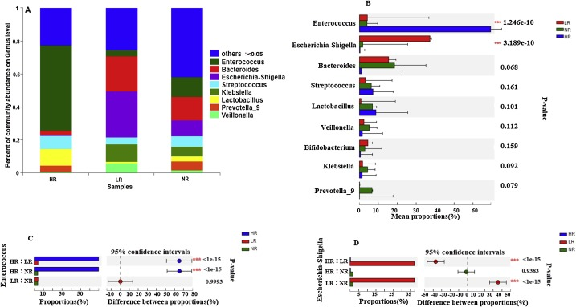
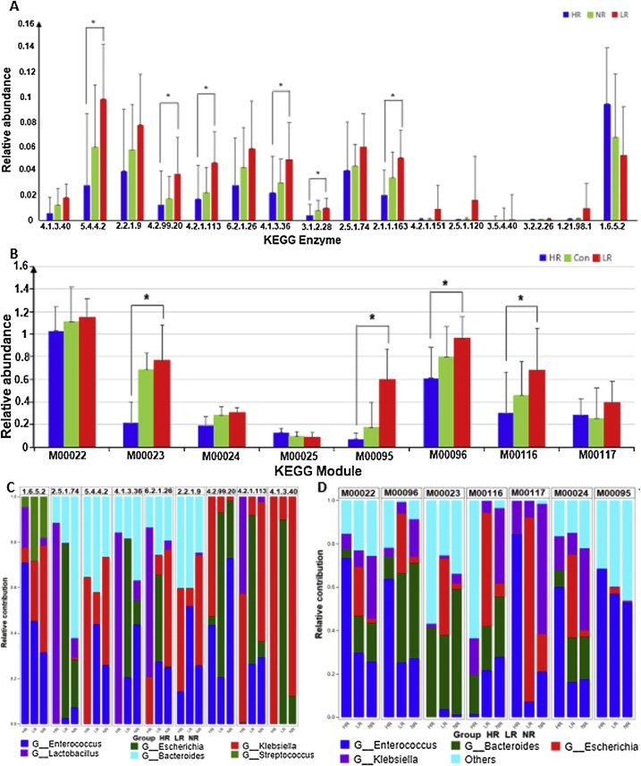

Warfarin pharmacogenomics has been on my mind for quite awhile. Warfarin acts as an anticoagulant by inhibiting the vitamin K cycle which is responsible for creating blood clotting factors. When I learned that vitamin K was produced by bacteria in the gut microbiome, I hypothesized that vitamin K producing capability of the gut microbiome would be associated with warfarin dose requirements. In my dissertation research I will investigate that exact question. Until we get that result, however, I will keep updated with the literature around the topic.

## The study

A paper titled "The gut microbes, Enterococcus and Escherichia-Shigella, affect the responses of heart valve replacement patients to the anticoagulant warfarin" was recently published suggesting the relationship between the gut microbiome and warfarin response. The study sequenced the 16S gene and the metagenome of stool samples of 80 and 15 warfarin users, respectively. The authors factorized the outcome by creating warfarin responder phenotype groups that were based on residuals from their previously published dose prediction model. 

## The results

#### 16S
The bacterial genera Enterococcus, Bacteroides, Escherichia-Shigella, Klebsiella, Streptococcus, Lactobacillus, Prevotella_9, Bifidobacterium and Veillonella were the top 9 dominant taxa among all responder phenotypes. Only two genera, *Enterococcus* and *Escherichia-Shiigella* were abundantly different among the phenotype groups. *Enterococcus* proportions were higher in the patients who were overpredicted by the dosing algorithm. Proportions of *Escherichia-Shigella* were higher in underpredicted patients. 

#### Metagenomics
The authors annotated genes using the KEGG functional database to investigate menaquinone biiosynthesis pathways in the groups. Interestingly, the patients underpredicted by the dosing algorithm contained increased levels of menaaquinone biosynthesis. The reverse was found in the opposite phenotype group. 

## The conclusions
The gut microbiota may affect responses to anticoagulation therapy, specifically with warfarin. Many questions remain regarding this novel finding including 1) do these findings replicate, 2) what species are differently abundant, 3) what genes are upregulated, and 4) can this data be used to predict patient's dose?