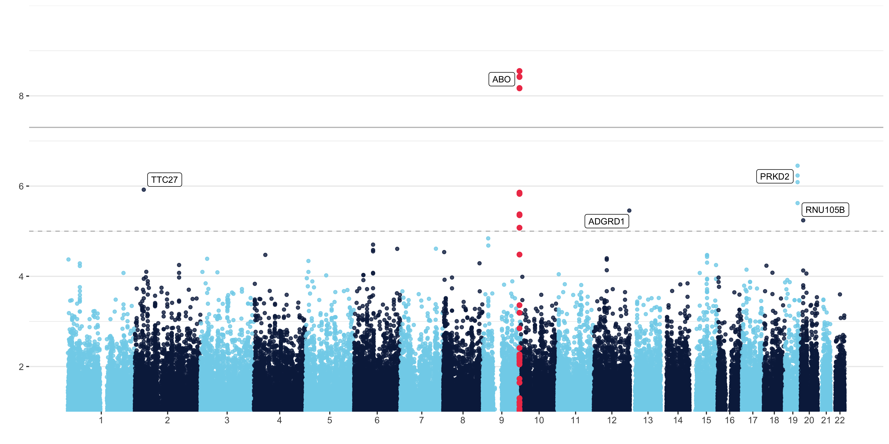

# Significance Skyline with Manhattan Plots

Manhattan plots are a type of scatter plot that show the statistical significance of a genomic variant with an outcome of interest. 
Yan Holtz made a self-annotating [manhattan plot](https://www.r-graph-gallery.com/101_Manhattan_plot.html) for the R Graph Gallery. His plot is beautiful and adds the rs# for the highest SNP in a signal. I (with the help of a Data Science Ambassador at UArizona) updated the plot to annotate with the gene that the SNP is in or nearest to after any given suggestive significance threshold. 

Additions to the code included locating the top SNP and SNPs of every chromosome. 
```{r eval = F}
## just top snp
topsnp = don2[which.min(don2$P),]

## top SNP per chromosome
topsnps = don2 %>%  
  group_by(CHR) %>% 
  slice(which.min(P)) %>% 
  filter(P < sugg)

## this gives just TOP Gene
topgene = gene_result %>% filter(topsnp$CHR == gene_result$chrom & 
                                    topsnp$BP >  gene_result$txStart &
                                    gene_result$txEnd > topsnp$BP)
```

I located the top genes with a few more lines of code... 
```{r eval = F}
topgene_out_fn = function(topsnps){
  gene_result %>%     filter(topsnps$CHR == gene_result$chrom &
                               topsnps$BP >  gene_result$txStart - 500000 &                                     gene_result$txEnd + 500000 > topsnps$BP)
  
}

topgenes_out = by(topsnps, topsnps$CHR, function(topsnps) topgene_out_fn(topsnps))

topgenes_out = do.call(rbind.data.frame, topgenes_out)

## remove dups? 
is_duplicate_out <- lapply(X = topgenes_out, FUN = duplicated, incomparables = FALSE)


drop_idx_out <- which(is_duplicate_out$name)
topgenes_out = topgenes_out[-drop_idx_out, ]

```

Then I got stuck trying to narrow down the dataset by choosing the gene which housed a SNP or was closest to it. After much deliberation, I reached out to a better coder than me to solve this problem. Cristian Román-Palacios is a PhD candidate and was a Data Science Ambassador at UArizona and graciously spent some time with me to teach me these next loops. Check out his work [on his GitHub!](https://github.com/cromanpa94)

```{r eval = F}
topgenes = list()

for (i in 1:nrow(topsnps)) {
  if(topsnps$CHR[i] %in% topgenes_in$chrom){
    topgenes[[i]] = topgenes_in[topgenes_in$chrom == topsnps$CHR[i],]}
  else{
   targetgenes =  topgenes_out[topgenes_out$chrom == topsnps$CHR[i],]
   
   ##Get the distance to each target gene
   distances<-list()
   for(j in 1:nrow(targetgenes)){
     if(targetgenes$exonStarts[j] > topsnps$BP[i]){
       distances[[j]] <-targetgenes$exonStarts[j]-topsnps$BP[i]
     }else{
       distances[[j]] <- topsnps$BP[i]-targetgenes$exonEnds[j]
     }
   }
   
   topgenes[[i]] =targetgenes[which.min(unlist(distances)),]
  }
  print(i) 
}

topgenes = do.call(rbind,topgenes)

```

## The result! 
This beautiful plot will come in super handy in my lab! 

