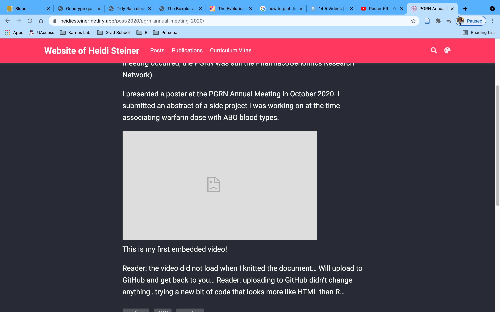

## Pharmacogenomics Global Research Network

(Actually this name is brand new, like yesterday. So in October, when this meeting occurred, the PGRN was still the PharmacoGenomics Research Network).  

I presented a poster at the PGRN Annual Meeting in October 2020. I submitted an abstract of a side project I was working on at the time associating warfarin dose with ABO blood types. 

<iframe width="950" height="534" src="https://www.youtube.com/embed/B_skTRxpXI0" title="YouTube video player" frameborder="0" allow="accelerometer; autoplay; clipboard-write; encrypted-media; gyroscope; picture-in-picture" allowfullscreen></iframe>

This is my first embedded video! 

Reader: the video did not load when I knitted the document... Will upload to GitHub and get back to you...
Reader: uploading to GitHub didn't change anything...trying a new bit of code that looks more like HTML than R...

 

Fail once, Fail twice. Third try...is a charm! Obtain the iframe code by right clicking on a youtube video and just paste this code in your rmd file! 

```{r eval =F} 
<iframe width="950" height="534" src="https://www.youtube.com/embed/B_skTRxpXI0" title="YouTube video player" frameborder="0" allow="accelerometer; autoplay; clipboard-write; encrypted-media; gyroscope; picture-in-picture" allowfullscreen></iframe>
```


Easy Peasy haha after a half hour of stalk overflow `r emo::ji("wink")`